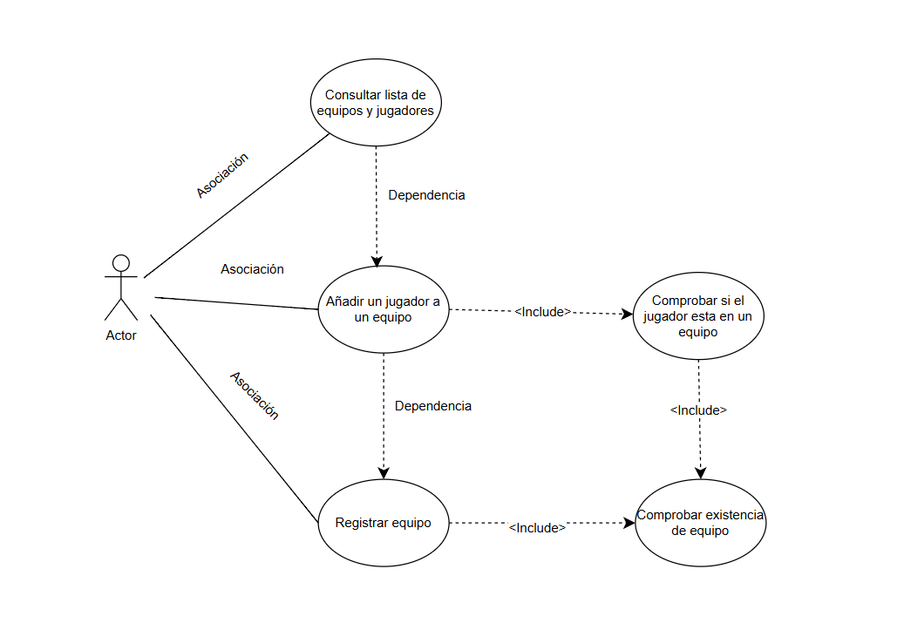
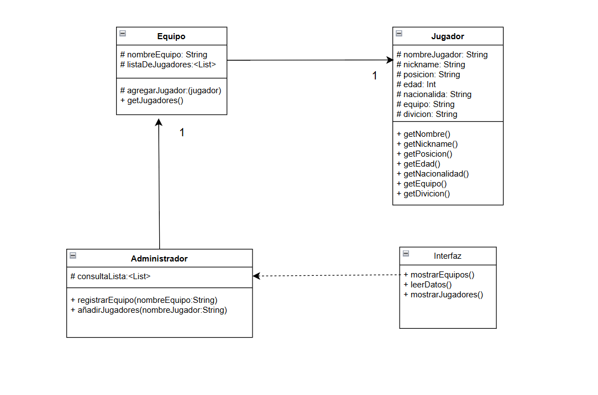

# Actividad 3 UML

## Diagrama de caso de uso

En la creación de este UML sobre gestión de equipos y jugadores, el equipo se registra en el torneo de Esport con el Administrador (Actor). Este recibe los datos de los jugadores para luego añadirlos al equipo, consultando la lista de equipos y jugadores existentes. Para evitar duplicidades tanto de equipos como de jugadores, se añaden dos comprobaciones: una que verifique la existencia de equipos y otra que confirme que el jugador solo se encuentre en un equipo.

## Identificación de clases y relaciones

| Clase | Tipo | Atributos principales | Métodos principales || **Clase**         | **Tipo**   | **Atributos principales**                | **Métodos principales**                                      |
|--------------------|------------|------------------------------------------|-------------------------------------------------------------|
| `Equipo`          | Entidad    | `nombre`, `lista de jugadores`           | `agregarJugador()`, `getJugadores()`                        |
| `Jugador`         | Entidad    | `nombre`, `nickname`, `posición`, `edad`, `nacionalidad`, `equipo`, `división` | `getNombre()`, `getNickname()`, `getPosicion()`, `getEdad()`, `getNacionalidad()`, `getEquipo()`, `getDivision()` |
| `Administrador`   | Control    | Consulta lista de equipos y jugadores    | `registrarEquipo()`, `añadirJugador()`                      |
| `Interfaz`        | Vista      |                                          | `mostrarEquipos()`, `leerDatos()`, `mostrarJugadores()`     |
| --- | --- | --- | --- |
| `Equipo` | Entidad | nombre, lista de jugadores | agregarJugador(), getJugadores() |
| `Jugador` | Entidad | nombre, nickname, posición, Edad, Nacionalidad, Equipo, división. | getNombre(), getNickname(), getPosicion(), getEdad(), getNacionalidad(), getEquipo(), getDivicion(). |
| `Administrador` | Control | Consulta lista de equipos y jugadores | registrarEquipo(), añadirJugador() |
| Interfaz | Vista |  | mostrarEquipos(), leerDatos() mostrarJugadores(). |
|  |  |  |  |

## Diagrama de clase

En el diagrama de clases de gestión de equipos y jugadores podemos observar que existe una relación de 1 a muchos entre el administrador y equipos. Igualmente, podemos observar que equipos tiene también una relación de muchos a 1, y que la interfaz tiene una relación de dependencia con Administrador.

El Administrador tiene una relación de uno a muchos porque un solo Administrador puede añadir múltiples equipos necesarios para el torneo.

El equipo tiene una relación de 1 a muchos porque un equipo, como entidad única y con nombre propio, solo puede existir una vez en el torneo, pero puede tener múltiples jugadores, incluyendo tanto al equipo principal como a los suplentes en la misma plantilla.

He añadido la interfaz con una relación de dependencia porque depende del Administrador para poder visualizar los equipos y jugadores de manera efectiva.

## Conclusión

### aprendizaje

En esta práctica, he aprendido a identificar actores y casos de uso, lo cual me ha permitido comprender mejor cómo interactúan los usuarios con el sistema. Además, he aprendido a crear diagramas de clases, herramientas valiosas que me permiten visualizar la estructura del programa antes de escribir el código en Java.

El proyecto me ha enseñado a utilizar UML (Lenguaje Unificado de Modelado) para representar la estructura y funcionalidad del sistema. Gracias a esto, he podido practicar el diseño orientado a objetos, identificando las entidades (objetos principales), los controladores (que gestionan la lógica del programa) y las interfaces (componentes con los que interactúan los usuarios).

En resumen, esta práctica me ha proporcionado una sólida base para entender cómo diseñar y desarrollar un sistema de manera organizada y eficiente.
